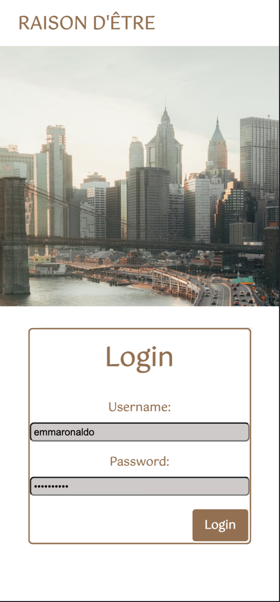
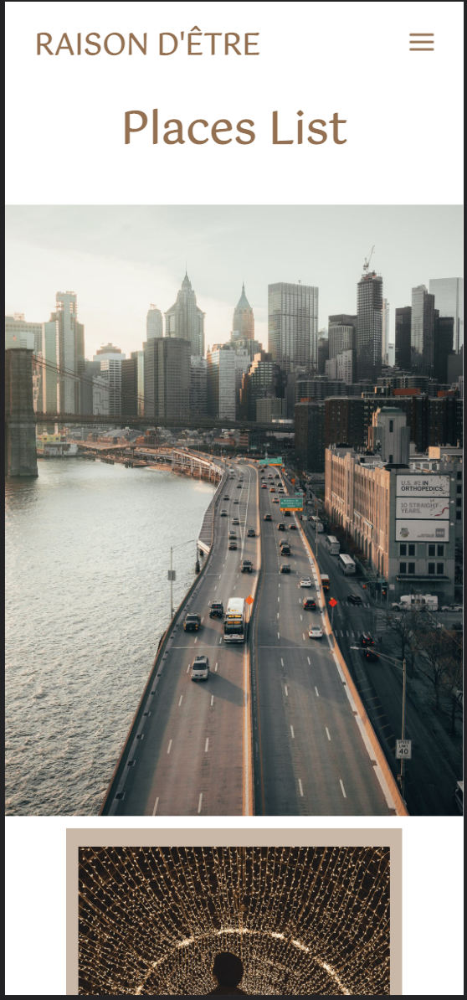
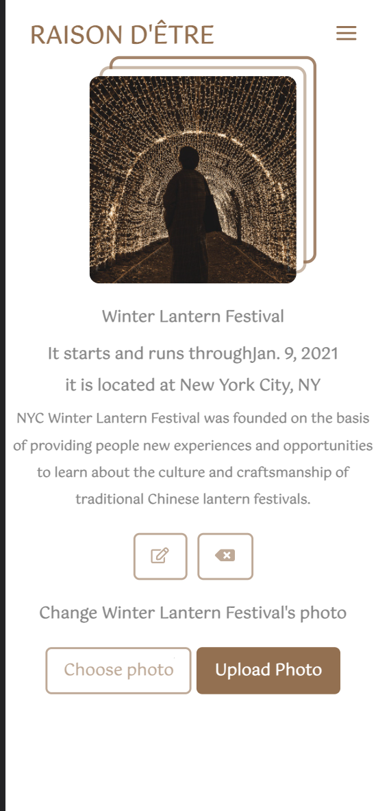
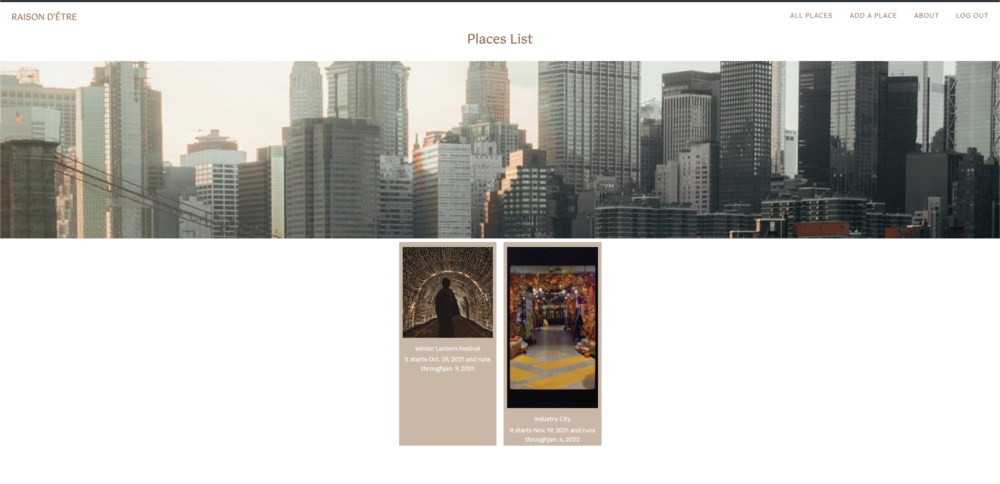

# Raison D'être 
## Project Description:	
Raison D'etre means a passionate aspiration or ambition and can be a synonym for bucket list. This is an app for everyone who is looking for somewhere to save all spots in their city that they want to visit.

## Deployed Link:
[ Try Me!](https://raison-detre.herokuapp.com/)

## Trello Boards:
[ click Here](https://trello.com/b/6diSYTod/project-3)

## Getting Started:

 

## Technologies Used: 

 Python 

 Javascrpt 

 CSS

 Django 

 HTML 

 Heroku 

## Future Endeavors:

Upload short videos i.e boomerang

Toggle dark/light mood

Create places in destination when while traveling

## Credits:
[Image](https://images.pexels.com/photos/3467149/pexels-photo-3467149.jpeg?auto=compress&cs=tinysrgb&dpr=2&h=750&w=1260)